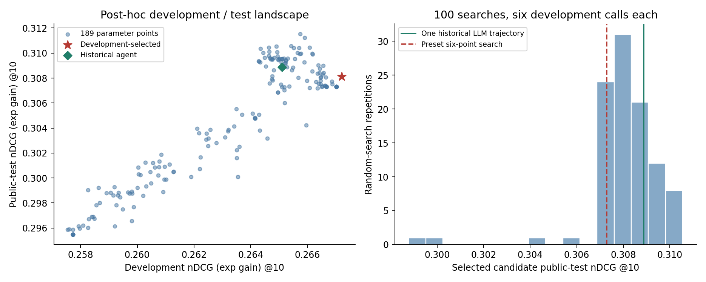
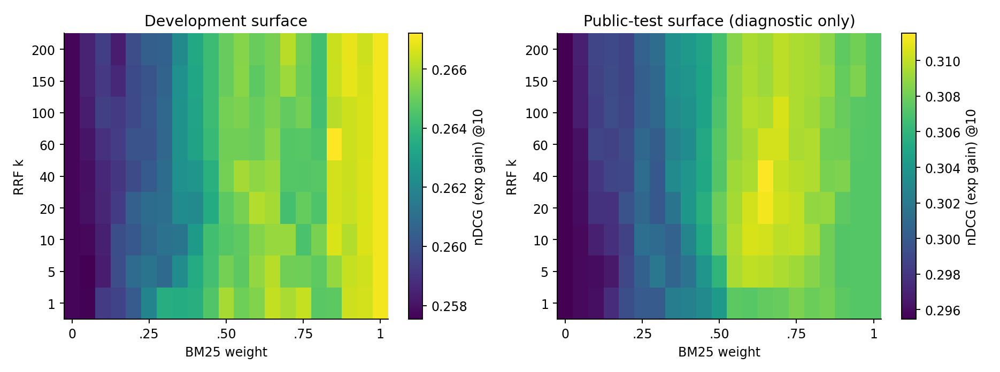

# 六次开发调用预算下的检索优化：优势、选择误差与不确定性

> 本文记录 v4 截止时的一条历史代理与事后搜索。v5 新增的三条真实轨迹及其较弱公开测试结果另见 [补实验报告](fresh-repeat-v5/研究补实验报告.md)；下文“单条”“三条未运行”均指 v4 当时的状态。

**结论：现有证据不足以称研究代理稳定优于搜索。** 历史单条代理轨迹的公开测试指数增益 nDCG@10 为 0.308875，相对预设六点搜索的差值为 +0.001581，查询配对 95% bootstrap 区间 [-0.002687, +0.005901] 包含零。更有价值的产出是一个可审查的研究任务与对照评价流程。

## 研究问题与可证伪判断

1. 在相同六次开发调用预算下，历史代理的候选能否明显优于无需 LLM 的搜索？若多数随机搜索接近其结果、配对区间包含零，则不能声称稳定优势。
2. 开发集选得更好是否代表测试集也更好？扫描有限参数面，观察开发排序与公开测试排序是否一致。
3. 结论是否依赖指标实现和分数并列规则？同时重算指数、线性增益，并使用完整稳定排序复核优化版部分排序。

## 任务与协议

NFCorpus 固定语料含 3,633 篇文档、324 条开发查询、323 条公开测试查询。先固定 BM25 和 TF-IDF 全文档排名，再只优化两个参数：

`score(d) = w/(k + rank_BM25(d)) + (1-w)/(k + rank_TFIDF(d))`

rank 从 1 开始，主评价为前十名 `nDCG_exp@10`，相关性增益 `2^rel−1`；另报告 `nDCG_linear@10`，增益 `rel`。历史主字段曾简称 `ndcg@10`，应按此指数定义理解，不能混充使用线性增益的结果。指标定义可对照 [NIST trec_eval 的 nDCG 实现](https://github.com/usnistgov/trec_eval/blob/master/m_ndcg_cut.c)。

历史代理由开发分数反馈驱动，实际完成六轮；预设六点按同一开发指标选优。新增随机搜索使用 1000–1099 共 100 个固定种子，每组独立抽取六个候选：整数 k 在 1–200 均匀取值，w 在 [0,1) 连续均匀抽取。每组只按开发分数最大者选择，平分取先出现者，再评价该候选的公开测试分数。

189 点网格由九个 k × 21 个 w 组成，用于研究参数面，不是与六次调用等预算的竞争算法。全部网格点都计算公开测试成绩，故这是明确的**事后诊断**，不得称盲测。旧结果在本阶段开始前已知；新测试最佳点仅用于展示选择误差，不替换原代理结果。

## 结果

|方案|开发 exp nDCG@10|公开测试 exp|公开测试 linear|
|---|---:|---:|---:|
|历史单条代理，k=60,w=.55|0.265111|0.308875|0.307968|
|预设六点选优，k=200,w=1|0.267026|0.307294|0.306414|
|189 点按开发选优，k=60,w=.85|0.267206|0.308123|0.307363|
|网格公开测试最高点，仅诊断|0.265750|0.311529|0.310579|

100 组随机搜索的获选候选测试均值为 **0.308102**，组间样本标准差 **0.001591**。历史代理高于或等于其中 72%；这是本任务、本随机分布的经验位置，不是新任务胜率，也不是 100 条 LLM 轨迹的表现。

网格开发最优点在测试上的枚举排序为 58/189；测试最高点在开发的枚举排序为 45/189。端点 w=0 或 1 的不同 k 会产生等价排名，序号含平分时的固定枚举顺序，189 个参数点不能看作 189 个独立模型。这些结果说明开发优化的收益并不自动迁移；现有任务不足以区分代理推理贡献与简单搜索机会。

## 不确定性与失败分析

对 323 条测试查询计算“代理减预设搜索”的逐查询差值，使用同一查询索引重采样 10,000 次，固定种子 20260923，报告百分位区间。它衡量的是固定这两个已选候选后对查询抽样的敏感性，**没有包含重新训练、重新选优、换数据集或换 LLM 的不确定性**。两个指标方向一致并不构成第二份独立证据。

曾发现加速排序在并列分数处没有严格保持冻结评价器的文档顺序。最终实现将阈值并列文档全部纳入，再按分数与原始文档索引排序；独立脚本从全部文档完整稳定排序重算。此修正改变部分网格序号，主历史对照和随机均值保持一致。日志与修正说明保留，不能用原序号覆盖最终结果。

## 核验与可复用产出

`verify_phase2.py` 重算 1,078 个不同“划分×候选”组合、348,983 个“查询×候选”评价，覆盖全部矩阵点、600 次随机开发调用、100 次随机最终测试、历史对照、101 次选优和 10,000 次 bootstrap。它检验数值和选择流程，不替代新的独立 LLM 实验。

可以复用的研究任务组件包括：明确可变参数、固定评分器、开发反馈接口、六次调用预算、先行假设日志、冻结选择、逐题结果和等预算基线。下一步若做新的确认实验，应换未见测试集、预先固定更广任务集合与多条独立 LLM 轨迹；本次不把未执行的计划算成果。

语料来自 [BEIR 官方 NFCorpus 快照](https://public.ukp.informatik.tu-darmstadt.de/thakur/BEIR/datasets/nfcorpus.zip)，下载 SHA 与固定评价器清单随包提供。三条新增 fresh-context 代理轨迹因工具容量未运行，所有申请表述明确保留此限制。
